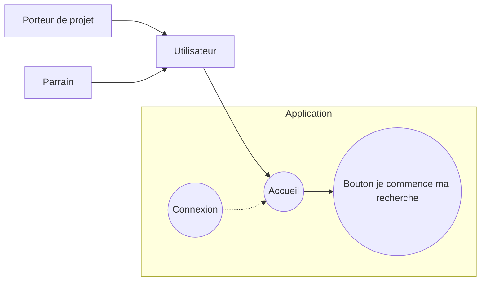
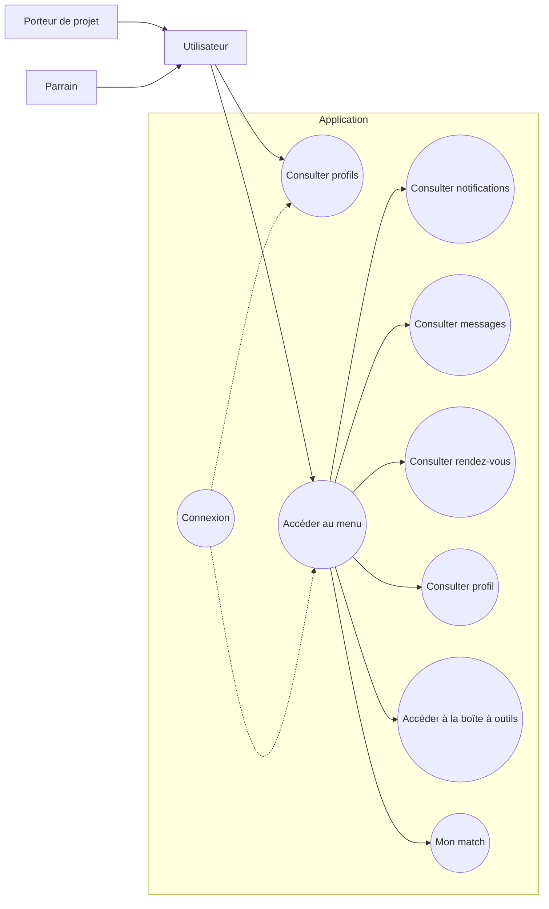
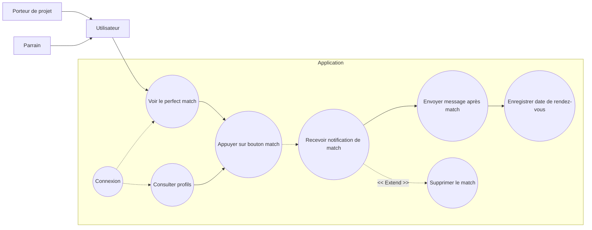
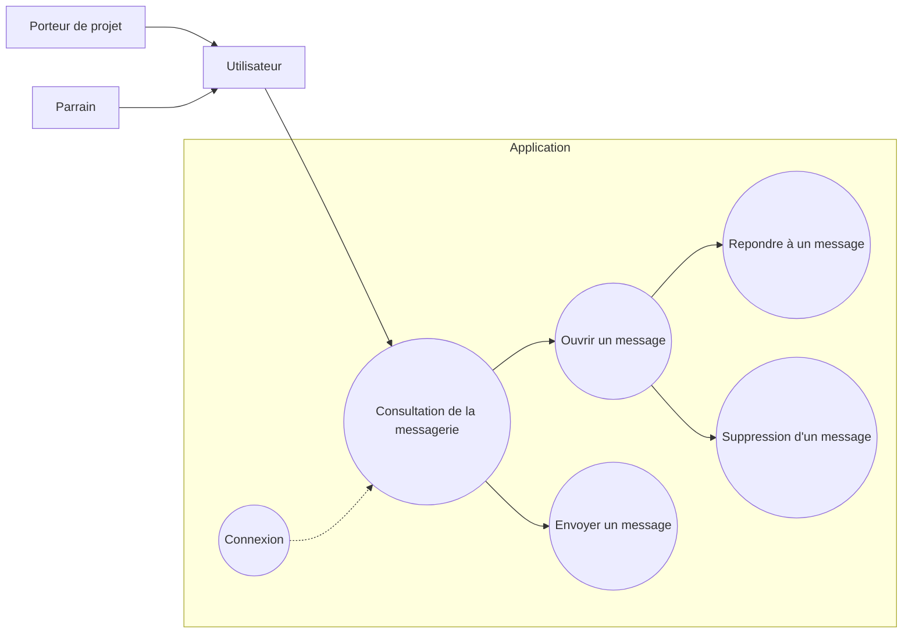
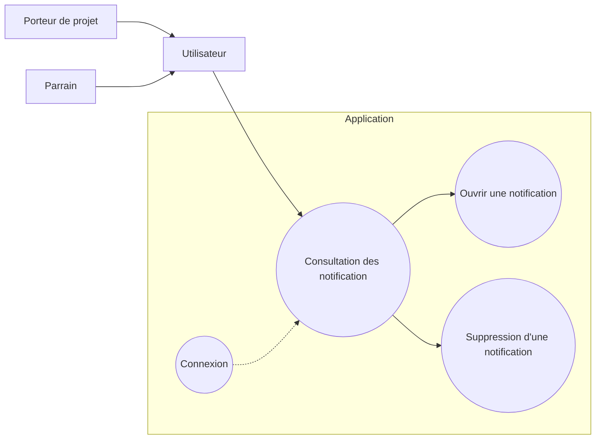
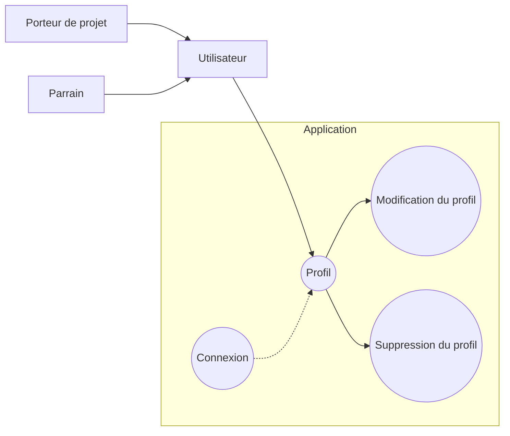
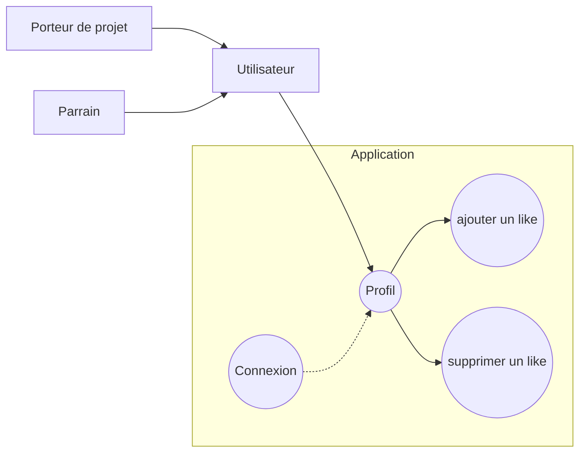
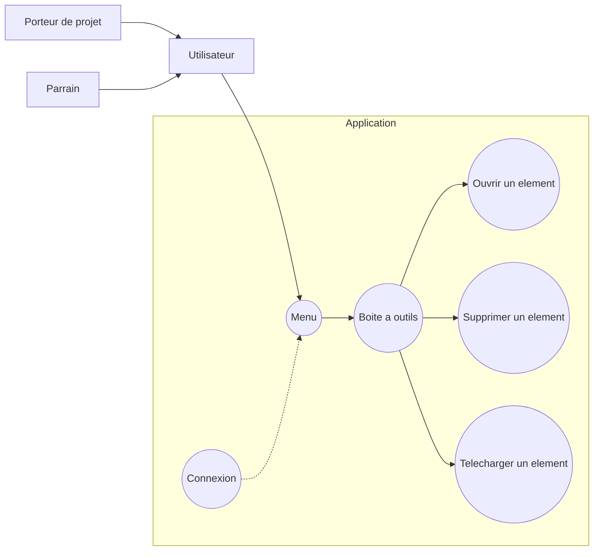

# Diagramme de cas d'utilisation : 

## Accueil Utilisateur

## Fil Utilisateurs

## Fil d'un match

## Fil Message

## Fil Notification

## Fil Profil

## Fil Consultation d'un profil

## Fil Boite à outils

