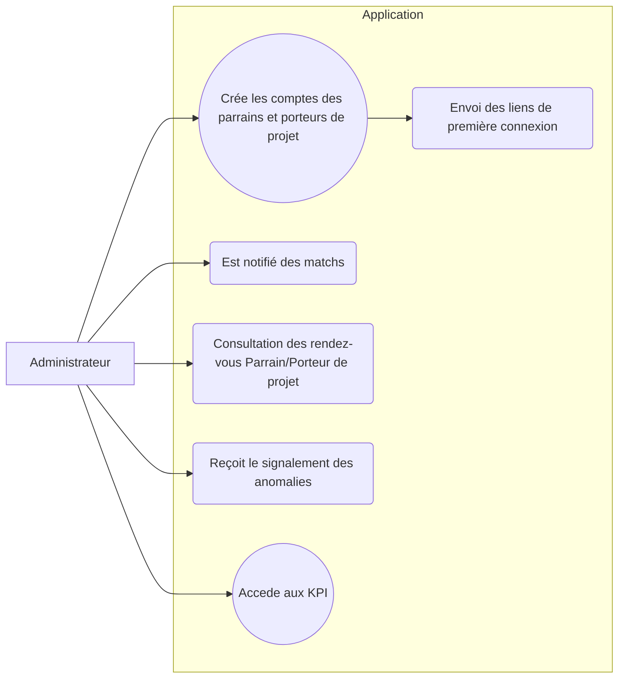
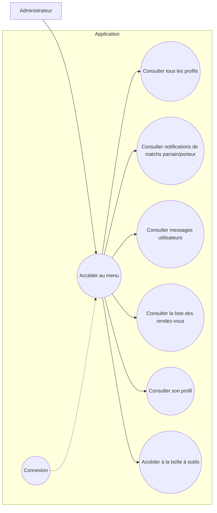

## Fil Administrateur

```mermaid
flowchart LR

    subgraph Application
        UC1((Crée les comptes des parrains et porteurs de projet))
        UC2(Envoi des liens de première connexion)
        UC3(Est notifié des matchs)
        UC4(Consultation des rendez-vous Parrain/Porteur de projet)
        UC5(Reçoit le signalement des anomalies)
        UC6((Accede aux KPI))

    end

    Actor1[Administrateur] --> UC1
    UC1 --> UC2
    Actor1 --> UC3
    Actor1 --> UC4
    Actor1 --> UC5
    Actor1 --> UC6
```

## Fil Menu Administrateur

```mermaid

flowchart LR

    subgraph Application
        UC2((Consulter tous les profils))
        UC9((Accéder au menu))
        UC10((Consulter notifications de matchs parrain/porteur))
        UC11((Consulter messages utilisateurs))
        UC12((Consulter la liste des rendez-vous))
        UC13((Consulter son profil))
        UC14((Accéder à la boîte à outils))
        UC16((Connexion))

    end

    Actor1[Administrateur] --> UC9
    
  

    UC16 -.-> UC9
    UC9 --> UC10
    UC9 --> UC11
    UC9 --> UC12
    UC9 --> UC13
    UC9 --> UC14
    UC9 --> UC2
    

```